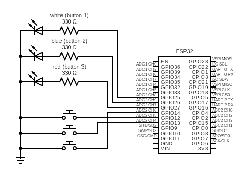
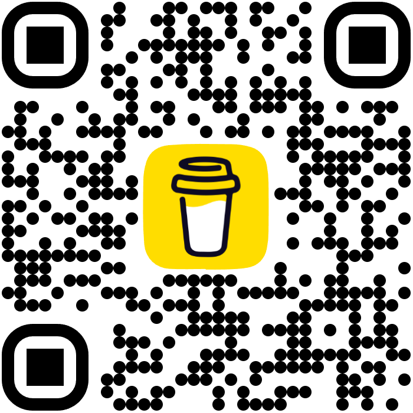

🎄 xmas gift picker v0.1
=========================

Hey there! 👋 

This is a fun little gift distribution web app I threw together over a weekend. It's basically a fancy random picker that makes giving out presents more exciting! You can customize it for Christmas or any other holiday or occasion.

What's cool about it? 🥳
----------------------
- Picks random gifts but with weighted chances (some gifts are more rare!)
- Has two modes: KID and TEEN (different gift pools)
- Fun animations themed for your occasion
- Risk levels from 1-5 that affect your chances of getting rare items
- Works with physical buttons via ESP32 BLE (optional)
- Background music and sound effects
- Stock tracking (gifts run out!)

Tech Stuff 🔧
-----------
- Frontend: HTML, CSS, JavaScript (with jQuery)
- Backend: Go
- Bluetooth: Web Bluetooth API + ESP32 (optional)
- Everything runs locally

How it Works 🎮
-------------
1. Pick KID or TEEN mode
2. Choose your risk level (1=safe picks, 5=risky but better rewards)
3. Hit the spin button
4. Watch Santa fly around and land on your gift!
5. Profit! 🎁

Customization Options 🎨
----------------------
- Change themes to fit any holiday or event (e.g., Halloween, Birthdays)
- Customize animations, sounds, and gift pools
- Update images and assets to match your occasion

ESP32 Integration (Optional) 🤖
----------------------------
- Can connect to an ESP32 board via BLE
- Use physical buttons instead of clicking
- Perfect for a Christmas party setup!
- Super basic protocol: just sends "button1", "button2", "button3"

Demo Videos 📹
------------
Check out how it works:
- Default Mode Demo:
https://github.com/user-attachments/assets/63cc1ad4-bb88-4763-98b9-ca068738d3f6

- ESP32 Controller Demo:
https://github.com/user-attachments/assets/d98be2c5-1d78-4193-bd89-a98dd0a41e06

ESP32 Schematics 📝
-----------------

Is it Perfect? 🤔
---------------
Nah, but it works and brings smiles! Built this for fun over a weekend, so expect some rough edges. Feel free to tweak and improve!

Give love to my cats 🐱
-------------------
Buy Me a Coffee: [Donate here](https://buymeacoffee.com/fluffymarkz)

Usage 🎯
-------
1. Run the Go server
2. Open localhost:8080
3. Start gifting!

That's it! Super simple, super fun. Perfect for small gatherings or gift distributions for any occasion. Enjoy! 🎉✨

P.S: Remember to add your own gifts in the config.json file, also generate your own UUIDs for BLE!
